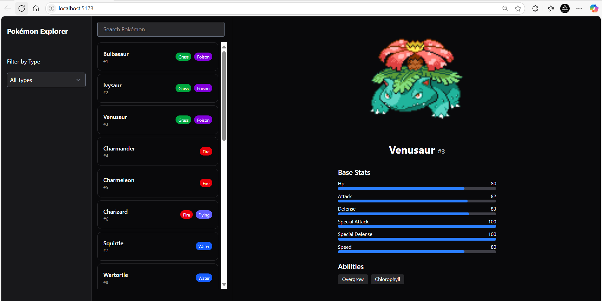

# 🧭 Pokémon Explorer



**Pokémon Explorer** is a sleek and responsive web application that allows users to browse, search, and explore detailed information about Pokémon from the official [PokéAPI](https://pokeapi.co/). The UI is inspired by modern dashboard layouts.

## 🌐 Live Demo

**✨ [Visit Pokemon Explorer](https://pokemon-explorer-pq7f.onrender.com) ✨**

> **Deployed on Render** - Fast, reliable, and always available!

---

## Features

- **Search by name** with live filtering
- **Filter by type** using multi-select dropdown
- **Detailed Pokémon view** (image, stats, abilities, types)
- **Fully responsive** and mobile-friendly design
- **Built with performance** in mind and clean animations

---

## Technologies Used

- **[SvelteKit](https://kit.svelte.dev/)** – Fast and modern web framework
- **[Svelte 5](https://svelte.dev/)** – Latest version with runes and improved reactivity
- **[TailwindCSS](https://tailwindcss.com/)** – Utility-first styling
- **[shadcn/ui](https://ui.shadcn.com/)** – Beautiful and accessible UI components
- **[PokéAPI](https://pokeapi.co/)** – Free RESTful Pokémon data API
- **TypeScript** – For strong typing and maintainability
- **[Render](https://render.com)** – Cloud platform for deployment

---

## � Getting Started

### Prerequisites

- **Node.js 20+** (recommended)
- **Bun 1.0+** (preferred) OR **npm/yarn**

> **⚠️ Important:** This project is optimized for **Bun** but works with npm/yarn as well.

### Installation

#### Option 1: Using Bun (Recommended)
```bash
# Clone the repo
git clone https://github.com/ItsThekra/Pokemon_Explorer.git
cd Pokemon_Explorer

# Install Bun if you haven't already
curl -fsSL https://bun.sh/install | bash

# Install dependencies
bun install

# Start development server
bun dev
```

#### Option 2: Using npm/yarn
```bash
# Clone the repo
git clone https://github.com/ItsThekra/Pokemon_Explorer.git
cd Pokemon_Explorer

# Remove bun.lock to avoid conflicts
rm bun.lock

# Install dependencies
npm install
# or
yarn install

# Start development server
npm run dev:npm
# or
yarn dev
```

### Development Commands

| Command | Bun | npm | Description |
|---------|-----|-----|-------------|
| Development | `bun dev` | `npm run dev:npm` | Start dev server |
| Build | `bun run build` | `npm run build:npm` | Build for production |
| Preview | `bun run preview` | `npm run preview:npm` | Preview build |
| Type Check | `bun run check` | `npm run check` | Run type checking |
| Format | `bun run format` | `npm run format` | Format code |
| Lint | `bun run lint` | `npm run lint` | Lint code |

---

## Deployment

This project is deployed on **[Render](https://render.com)** with automatic deployments from the main branch.

### Live Environment
- **URL**: [https://pokemon-explorer-pq7f.onrender.com](https://pokemon-explorer-pq7f.onrender.com)
- **Platform**: Render (Free Tier)
---

## Project Structure

```
src/
├── lib/
│   ├── components/           # Reusable Svelte components
│   │   ├── ui/              # shadcn/ui components
│   │   ├── Card.svelte      # Pokemon card component
│   │   └── SearchBar.svelte # Search component
│   ├── utils/
│   │   └── network.ts       # Network utilities with retry logic
│   ├── config.ts            # App configuration
│   ├── server.ts            # Server utilities
│   └── types.ts             # TypeScript type definitions
├── routes/
│   ├── api/                 # API endpoints
│   │   ├── pokemon/         # Pokemon data endpoints
│   │   └── types/           # Pokemon types endpoint
│   ├── +layout.svelte       # App layout
│   ├── +page.svelte         # Main page
│   └── +page.server.ts      # Server-side data loading
└── app.html                 # HTML template
```


🎮 *Gotta catch 'em all!* 🎮
